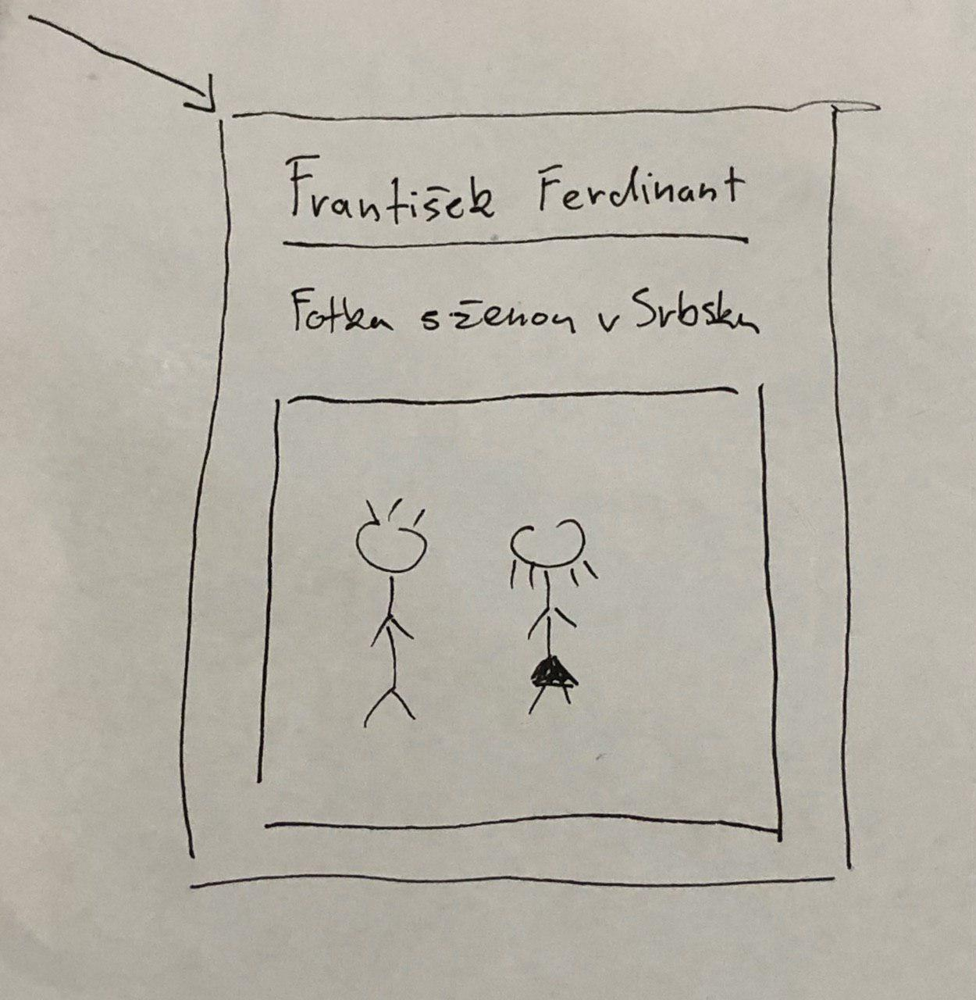

# UPA projekt 2019

<!---------------------------------------------------------------------->

## Tým Asdf

### Členové

- xdusek27
- xkalaj01
- xkubov06

### Téma projektu

- Nástroj pro vytváření myšlenkových map

### Jak spustit

- Projekt používá buildovací systém Gradle
- Pro přeložení a spuštění projektu je přiložen Makefile

Překlad
```
$ make build
```

Spuštění
```
$ make run
```

Smazání přeložených souborů
```
$ make clean
```

<!---------------------------------------------------------------------->

## App


<!---------------------------------------------------------------------->

## Code conventions

- Zkusíme aspoň +/- dodržovat něco takového, ať je to trochu konzistentní.
- Odsazení 4 mezery

```java
class HelloWorld
{
    void fooFoo()
    {
        while (statement) {
            int i = 0;
        }

        if (statement) {
            String s = "a";
        }
        else {
            i = 1; // bleh
        }
    }
}
```

<!---------------------------------------------------------------------->

## Zadání

Desktopová aplikace pro vytváření myšlenkových map. Možnost vkládat více druhů
geometrických entit (elipsa, obdélník, ...). Jejich přesun a změna velikosti pomocí
kurzoru. Do každé takovéto entity možnost vložit text. Déle je možné do mapy
vkládat obrázky a je umožněna jejich základní modifikace (přesun, změna velikosti,
rotace). Geometrické entity a obrázky je možné spojovat orientovanou hranou a tím
vytvářet hierarchický vztah, který je běžný pro myšlenkové mapy.

### Body zadání a jejich realizace

#### Multimediální databáze

- Operace vkládání, mazání a úprava multimédií (alespoň statických obrázků,
kde operace úprava může být např. jejich rotace).
    - Možnost vložit / smazat / rotovat obrázek do myšlenkové mapy
    - Možnost jeho propojení s dalšími elementy mapy
- Jejich vyhledávání dle multimediálního obsahu
    - Vyhledání všech entit, které obsahují daný obrázek, pro uživatele
      například zvýraznění takovýchto entit

#### Prostorové databáze

- Operace vkládání, mazání a změna uživatelských prostorových dat pro alespoň 4 druhů
geometrických entit (různé hodnoty SDO_GTYPE v SDO_GEOMETRY), a to interaktivní formou
(např. změna souřadnic a velikosti entit tažením kurzoru na mapě)
    - Možnost vložit, kurzorem přesunout, změnit velikost geometrické entity
- Netriviální použití alespoň jednoho prostorového operátoru
(výsledkem je geometrie, využívá index)
    - Například spojení dvou geometrických entit, může být realizováno jako
    nejkratší vzdálenost mezi nimi (spojení entit hranou)
- Dalších 2 prostorových operátorů (opět geometrie s indexem) nebo funkcí
(výsledkem je geometrie, ale index není potřeba)
    - Sjednocení dvou entit do jedné, spojení i jejich podprvků
    - Průnik hrany a jiné entity, vytvořena je nová hrana, která má s původní entitou
      prázdný průnik
- Alespoň 3 analytických funkcí nebo operací (výsledkem je číslo, např. obvod geometrie)
demonstrujících práci nad prostorovými daty (pro příklady vizte demonstrační cvičení)
    - Někde můžeme zobrazovat velikost geometrické entity (obvod, obsah) pro spojení
    například jeho délku

#### Obecně k databázi
- Databáze (schéma a data) musí běžet na databázovém serveru Oracle 12c a vyšší s tím,
  že jako referenční platforma slouží fakultní databázový server Oracle určený pro
  tento předmět.
    - Ano

#### Obecně k aplikaci

- Aplikace s grafickým uživatelským rozhraním (použitelná nápověda, intuitivní ovládání)
běžící spolehlivě na platformách Linux nebo Windows, která se připojuje k databázovému
serveru a využívá funkcí prostorových a multimediálních databází včetně propojení
s relačními daty.
- Aplikace musí umožňovat volbu přihlašovacích údajů pro připojení k databázovému serveru
a (znovu) naplnění tamní databáze tabulkami se sadou ukázkových dat
(implementováno např. formou s aplikací dodávaného inicializačního skriptu,
jehož příkazy aplikace na požádání přečte a odešle do připojené databáze).
- Preferovaný implementační jazyk je Java, ale je možné zvolit i jiný, avšak ověřte si,
že má podporu pro připojení k databázi Oracle nejlépe i s podporou jejích
multimediálních a prostorových rozšíření.
- Využití pouze výtvorů a knihoven jejichž jste autorem nebo jsou běžně dostupné
se základní distribucí implementačního jazyka (pro Javu tedy Java SE/EE knihovny,
dostupné např. s JDK 8 a Java EE), s distribucí použitého vývojového prostředí
(IntelliJ, jDeveloper, NetBeans, Eclipse) a knihovny Oracle (ze stránek nebo cvičení);
použití cizích zdrojových kódů (i částí) a dalších knihoven vyžaduje schválení
(žádost emailem cvičícímu s odkazem na knihovnu a zdůvodněním plánovaného použití).

#### Další

- Aby myšlenková mapa dávala smysl do geometrických entit musí být možné vložit text.

#### Složení diagramu

- Uzel
    - Kořen, který sám o sobě reprezentuje celou mapu
- Složení uzlu
    - Text
        - Nadpis, název
        - Popis, komentář
    - Obrázek
    - Ohraničující geometrická entita (obdélník, kosodelník, elipsa)
        - Minimální velikost taková, aby se veškerý obsah vešel dovnitř
    - Barva pozadí
- Operace
    - Přemísťování uzlu
    - Změna velikosti uzlu
    - Sjednoducení dvou uzlů
        - Jednoduché - max jeden obrázek, text se sloučí
          (nadpis = nadpis1, nadpis2; komentář = \*komentář1`\n`\*komentář2)
    - Spojení dvou uzlů hranou
        - Aplikace získá hranu z databáze
            1) Ziská nejkratší hranu mezi dvěma objektami
            2) Najde průnik hrany s jiným uzlem
            3) Pokud je průnik neprázdný přepočítá hranu jako nějakou
               lomennou úsečku

#### Design uzlu

##### 1) Jednoduchý (do prototypu)
- Geometrická entita ohraničuje veškerý obsah uzlu




##### 2) Minimalizovatelný obrázek (koncept)
- Geometrická entita ohraničuje pouze text, obrázek je ve formě
  nějakého preview, možnost jeho zobrazení


<!---------------------------------------------------------------------->

## Nápady

### Obrázky v entitách

- Obrázek bude samostatná entita, respektive entita bude ohraničovat obrázek,
  bude mít velikost obrázku

### Ukázkové případy
- Ukázková mapa např. osobnosti Rakouska-Uherska

### Myšlenkové mapy


<!---------------------------------------------------------------------->

## Links

- [rychly-edu.gitlab.io/dbs/](https://rychly-edu.gitlab.io/dbs/)
- [docs.oracle.com/database/121/SPATL/](https://docs.oracle.com/database/121/SPATL/)
