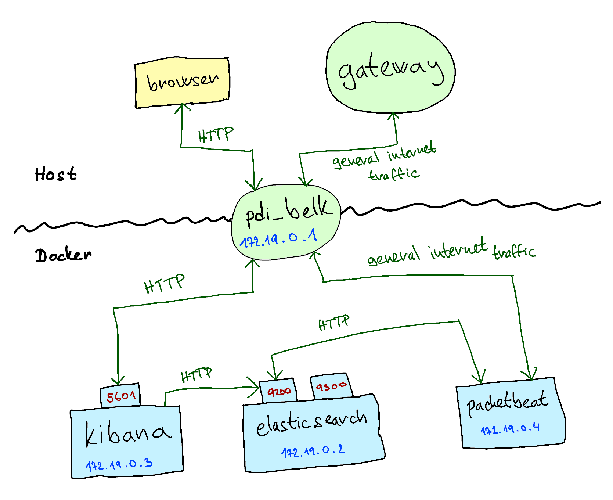

# Dokumentace

<!----------------------------------------------------------------------------->

## Zadání

- Varianta termínu: [Jeřábek] Zprovozněte a vyzkoušejte Packet Beat s Elastic search a reportováním do Kibana

### Popis varianty
- Vyzkoušejte a zprovozněte nástroj pro práci se síťovými daty Packet Beat v kombinaci s Elastic Search a reportováním a vizualizací v Kibana.
- Prostudujte si jednotlivé nástroje a pokuste se vše nastavit a lokálně spustit pomocí Docker kontejnerů.
- Váš výsledný správný postup pro nastavení zaznamenejte v krátké dokumentaci (spíše postup) a výsledné řešení demonstrujte.
- Primárně se zaměřte na získání informací z flow a TLS.

**Požadované výstupy:**
- Připravte docker-compose konfigurační soubor(y) pro zprovoznění celého systému.
- Krátká dokumentace s postupem nasazení.
- Demonstrace funkčnosti.

**Reference:**
- https://www.elastic.co/guide/en/beats/packetbeat/current/index.html

<!----------------------------------------------------------------------------->

## Úvod

Cílem projektu je zprovoznit architekturu BELK — Beasts, Elasticsearch, Logstash, Kibana (Elastic Stack). Respektive Packetbeat + Elasticsearch + Kibana pomocí Docker kontejnerů.

Beats je sada nástrojů, která slouží pro monitorování systémů. **Packetbeat** je pak konkrétně pro monitorování síťového provozu. Jedná se o agenta, který je umístěň na uzel, jenž má být monitorován. Sbírá informace a průběžně je posílá přes REST API do databáze Elasticsearch.

**Elasticsearch** je distribuovaná NoSQL databáze pro různá data. Poskytuje jednoduché REST API pro interakci. Je dobře škálovatelná, lze snadno přidávat další uzly.

**Kibana** je webová aplikace pro vizualizaci dat z Elasticsearch. Umožňuje v datech vyhledávat a automaticky vytváří ruzné dashboardy.

<!----------------------------------------------------------------------------->

## Architektura

- Každá komponenta Elastic Stacku běží ve vlastním kontejneru.
- Na stránce [docker.elastic.co](https://www.docker.elastic.co/) jsou dostupné připravené Image pro jednotlivé komponenty.
- Všechny kontejnery jsou připojeny do lokální sítě typu Bridge, kde mezi sebou vzájemně komunikují.
    - Kontejner, kde běží Packetbeat (který je monitorován) bude také komunikovat skrze host OS do internetu.



Definice network:
```yaml
networks:
  belk:
    driver: bridge
```

### Elasticsearch kontejner

- Otevřený port 9200 pro komunikaci přes REST API.
    - Už v převzaté definici image je otevřený také port 9300. Port 9200 slouží pro komunikaci s clusterem jako celkem, na portu 9300 pak komunikují jednotlivé uzly mezi sebou.
- Přes environment variables je třeba konfigurovat cluster (počet uzlů, jejich jména, ...).
- Poskytnout sdílený volume pro zajištění perzistence databáze.

Definice služby `elasticsearch`:
```yaml
elasticsearch:
  image: "docker.elastic.co/elasticsearch/elasticsearch:7.10.0"
  container_name: elasticsearch
  restart: always
  environment:
    - discovery.type=single-node
  ulimits:
    memlock:
      soft: -1
      hard: -1
  volumes:
    - "data:/usr/share/elasticsearch/data"
  expose:
    - "9200"
    - "9300"
  networks:
    - belk
```

Definice sdíleného volume:
```yaml
volumes:
  data:
    driver: local
```

V případě přidávání dalších uzlů, je třeba nastavit další environment variables:
```yaml
  environment:
    - node.name=es_01
    - cluster.name=elasticsearch_cluster
    - discovery.seed_hosts=es02,...,es_n
    - cluster.initial_master_nodes=es01,es02,...,es_n
    - bootstrap.memory_lock=true
    - "ES_JAVA_OPTS=-Xms512m -Xmx512m"
```

### Kibana kontejner

- Otevřený port 5601 pro HTTP komunikaci — přístup klienta k webové aplikaci.
- Přes environment variables je nutné specifikovat URI pro komunikaci s Elasticsearch clusterem.

Definice služby `kibana`:
```yaml
kibana:
  image: "docker.elastic.co/kibana/kibana:7.10.0"
  container_name: kibana
  restart: always
  environment:
    ELASTICSEARCH_URL: "http://elasticsearch:9200"
    ELASTICSEARCH_HOSTS: "http://elasticsearch:9200"
  ports:
    - "5601:5601"
  networks:
    - belk
  depends_on:
    - elasticsearch
```

### Monitorovaný kontejner

- Na monitorovaném kontejneru běží agent Packetbeat.
- Pomocí konfiguračního souboru `packetbeat.yml` je třeba nastavit co vše se má monitorovat a také specifikovat URI pro komunikaci s Elasticsearch a Kibana.
- Kontejneru je třeba přidělit některá nadstandardní práva (NET_ADMIN) pro účely monitorování síťového provozu.

Příklad konfiguračního souboru `packetbeat.yml`:
```yaml
packetbeat.interfaces.device: eth0
packetbeat.flows:
  timeout: 30s
  period: 10s
packetbeat.protocols:
  - type: icmp
    enabled: true
  - type: dhcpv4
    enabled: true
    ports: [67, 68]
  - type: dns
    enabled: true
    ports: [53]
    include_authorities: true
    include_additionals: true
  - type: http
    enabled: true
    ports: [80, 8080, 8000, 5000, 8002]
  - type: tls
    enabled: true
    ports: [443, 993, 995, 5223, 8443, 8883, 9243]
    fingerprints: [md5, sha1, sha256]
    send_certificates: true
processors:
  - add_cloud_metadata: ~
output.elasticsearch:
  hosts: ["elasticsearch:9200"]
setup.dashboards.enabled: true
setup.kibana:
  host: "kibana:5601"
```

Definice vlastního Dockerfilu, který pouze do připraveného image přidává konfigurační soubor:
```Dockerfile
FROM docker.elastic.co/beats/packetbeat:7.10.0
COPY packetbeat.yaml /usr/share/packetbeat/packetbeat.yml
USER root
RUN chown root:packetbeat /usr/share/packetbeat/packetbeat.yml
USER packetbeat
```

Definice služby `packetbeat`:
```yaml
packetbeat:
  image: "packetbeat:latest"
  container_name: packetbeat
  restart: always
  build:
    context: ./
    dockerfile: Packetbeat.Dockerfile
  cap_add:
    - NET_ADMIN
  networks:
    - belk
  depends_on:
    - kibana
```

<!----------------------------------------------------------------------------->

## Spuštění systému

Spuštění všech kontejnerů podle definic v `docker-compose.yaml`:
```
$ docker-compose up --build --detach
```

Kontrola stavu kontejnerů:
```
$ docker-compose ps
    Name                   Command               State                Ports
-----------------------------------------------------------------------------------------
elasticsearch   /tini -- /usr/local/bin/do ...   Up      9200/tcp, 9300/tcp
kibana          /usr/local/bin/dumb-init - ...   Up      0.0.0.0:5601->5601/tcp
packetbeat      /usr/local/bin/docker-entr ...   Up
```

Zobrazení logů:
```
$ docker-compose logs --follow {elasticsearch|kibana|packetbeat}
...
```

Definice volume:
```
$ docker volume inspect pdi_data
[
    {
        "CreatedAt": "2020-11-24T14:58:01+01:00",
        "Driver": "local",
        "Labels": {
            "com.docker.compose.project": "pdi",
            "com.docker.compose.version": "1.27.4",
            "com.docker.compose.volume": "data"
        },
        "Mountpoint": "/var/lib/docker/volumes/pdi_data/_data",
        "Name": "pdi_data",
        "Options": null,
        "Scope": "local"
    }
]
```

Definice network:
```
$ docker network inspect pdi_belk
[
  {
    "Name": "pdi_belk",
    ...
    "Scope": "local",
    "Driver": "bridge",
    ...
    "IPAM": {
        ...
      "Config": [
        {
          "Subnet": "172.19.0.0/16",
          "Gateway": "172.19.0.1"
        }
      ]
    },
    ...
    "Containers": {
      "91a685a80ec59ed7434ad5406be6d29e7d233d9371902bee4e89615f5f705e25": {
        "Name": "packetbeat",
        "EndpointID": "83680a195c2ae3f392dde616da303e1d23eacfd1383ae3ed40dd3e2d93c228bc",
        "MacAddress": "02:42:ac:13:00:04",
        "IPv4Address": "172.19.0.4/16",
        "IPv6Address": ""
      },
      "ba517a7e7f4fbf1f46e729567b26c4255b58e40ff0ea16503558446aba093134": {
        "Name": "kibana",
        "EndpointID": "b97239861506cce900f2ca7f31968a982f2f39ece8e316394f52799108442264",
        "MacAddress": "02:42:ac:13:00:03",
        "IPv4Address": "172.19.0.3/16",
        "IPv6Address": ""
      },
      "e21e4a911465a1e0f28eb4b2f998b39364e5e66215850f2bffd1652151039699": {
        "Name": "elasticsearch",
        "EndpointID": "3208017d19a8b2eb913ee885d4bf7f59d44ccc9bfb626f3f1c38b3a42c39223e",
        "MacAddress": "02:42:ac:13:00:02",
        "IPv4Address": "172.19.0.2/16",
        "IPv6Address": ""
      }
    },
    ...
    "Labels": {
      "com.docker.compose.network": "belk",
      "com.docker.compose.project": "pdi",
      "com.docker.compose.version": "1.27.4"
    }
  }
]
```

<!----------------------------------------------------------------------------->

## Simulace síťového provozu

Spuštění bashe uvnitř kontejneru:
```
$ docker exec --interactive --tty packetbeat bash
```

`ping` (ICMP, DNS):
```
$ ping vutbr.cz
```

`curl` (DNS, HTTP, TLS):
```
$ curl --verbose https://www.google.com --output /dev/null
```
