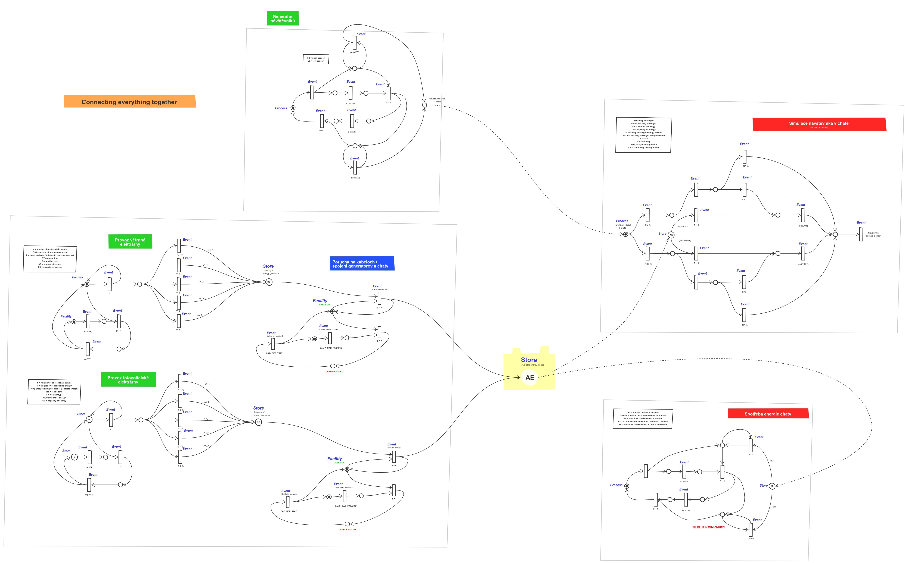
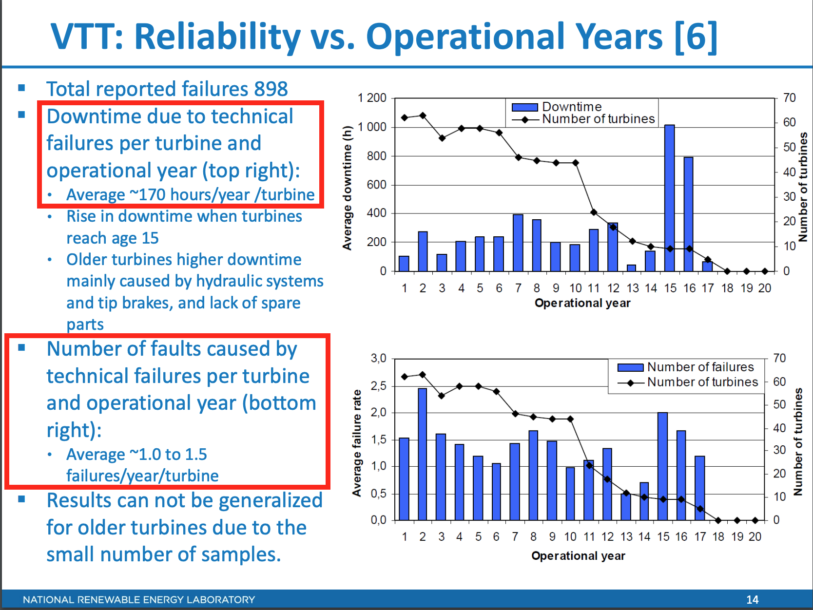
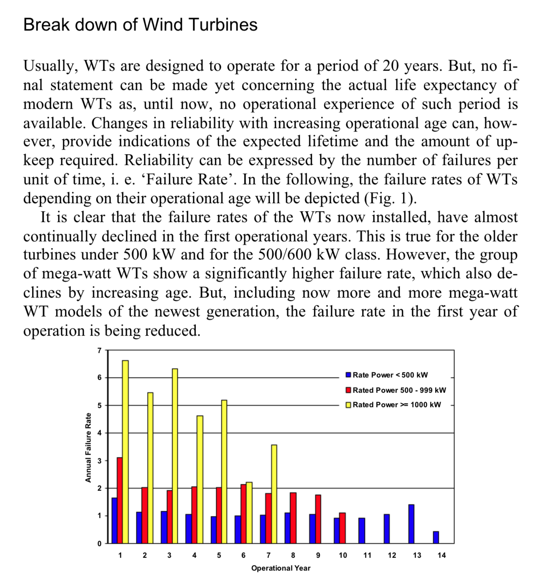

# IMS

> [**Full Zadanie**](http://perchta.fit.vutbr.cz:8000/vyuka-ims/24) 
> — Problematiky modelujte vhodným způsobem jako diskrétní systém

> [**TLDR;**](_TASK.md) 
> — Skratena verzia zadania, len to co je podstatne..

> [**SIMLIB Cheatsheet**](SIMLIB-cheatsheet.md) 
> — Useky kodu z prezentacii. Vysvetlenie jednotlivych prostriedkov pre modelovanie

> [**Sketch board**](https://sketchboard.me/FBlrWMlsZFmn#/) 
> — Náčrty, Petriho síť

---

**Cielom simulacie** je: Ziskanie novych informacii o chovani systemu v zavislosti na vstupnych velicinach.

---

## Petriho siet / abstraktny model

## Téma projektu

**Služby, infrastruktura a energetika**

Zvolte si problematiku z oblasti:

1. komerčních služeb pro občany a firmy
2. infrastruktury (voda, plyn, kanalizace, odpadní hospodářství, ...)
3. energetiky a sítí (výroba elektřiny z uhlí, vody, větru, slunce apod, distribuce elektřiny, smartgrids, rozvodné sítě pro elektromobily apod).

Problematiky modelujte vhodným způsobem jako diskrétní systém. Experimenty zjišťujte rizika, možnosti rozvoje, ekonomické aspekty apod.

## Konkrétní zadání

Simulovat provoz chaty Triglavski dom na Kredarici z hlediska spotřeby a výroby energie. Chata se nachází v horském sedle pod vrcholem Triglavu, kde je velmi větrné podnebí. K chatě nevedou dráty vysokého elektrického napětí a veškerá energie je vyráběna větrnou turbínou, která stojí vedle chaty. Jak je na tom chata s elektřinou když jsou špatné povětrnostní podmínky? Jak často je chata bez energie? Jaká jsou rizika nějaké nehody?

## Odovzdanie

- testovanie na merlin.fit.vutbr.cz
- makefile w/ "make", "make run"
- dokumentacia vo formate PDF
- odovzdavany archiv vo formate .zip alebo .tar.gz
- nazov odovzdavaneho archivu: **01_xdusek27_xnanoa00.zip**

## IMS studijní materiály

### Obecně
- https://www.fit.vutbr.cz/study/courses/IMS/public/.cs
- https://www.fit.vutbr.cz/study/courses/IMS/private/.cs
- http://perchta.fit.vutbr.cz/vyuka-ims
- http://www.fit.vutbr.cz/~peringer/SIMLIB/
- http://www.fit.vutbr.cz/~peringer/UNOFFICIAL/

### Konkrétní
- [Povinná struktura dokumentace](http://perchta.fit.vutbr.cz/vyuka-ims/16)
- [IMS slides](https://www.fit.vutbr.cz/study/courses/IMS/public/prednasky/IMS.pdf)
- [IMS skripta](https://www.fit.vutbr.cz/study/courses/IMS/private/SkriptaMS.pdf)
- [První democvičení](http://perchta.fit.vutbr.cz:8000/vyuka-ims/uploads/1/ims-demo1.pdf)
- [Druhé democvičení](http://perchta.fit.vutbr.cz:8000/vyuka-ims/uploads/1/diskr2-2011.pdf)
- [Dokumentace SIMLIB](http://www.fit.vutbr.cz/~peringer/SIMLIB/doc/SimLib-doc-2.ps)
- [Doxygen dokumentace SIMLIB](https://www.fit.vutbr.cz/~peringer/SIMLIB/doc/html/)
- [Příklady SIMLIB](http://www.fit.vutbr.cz/~peringer/SIMLIB/examples/)

## Inspirace loňskými projekty
- https://github.com/kzaklova/FIT/tree/master/3BITZ/IMS
- https://github.com/vmasek/IMS-project
- https://github.com/H00N24/IMS
- https://github.com/hkalina/IMSvolby

## Zdroje informací

### Chata, turisté
- https://en.wikipedia.org/wiki/Triglav_Lodge_at_Kredarica
    - Cíl: snížit dopad na životní prostředí, proto obnovitelné zdroje energie
    - Ne jenom větrná turbína, ale i fotovoltaická elektrárna
    - Většina návštěvníků v období hlavní sezóny (červen-září), zahrnout do generátoru návštěvníků? Možná větší vliv než den/noc.
- https://www.summitpost.org/kredarica-hut-triglavski-dom-na-kredarici/349588
    - Služby: teplá voda, elektřina, topení, záchody, restaurace, možnost přespání
    - 140 postelí, 160 lůžek (může pomoci při kalkulaci potřebné energie)
    - Dále dostupná nabídka jídel a nápojů
    - V chatě je zároveň meteorologická stanice, neměl by být tedy problém dostat se k údajům o počasí (potřebné pro zjištění výkonu elektráren)
- https://www.explore-share.com/blog/climbing-mount-triglav-slovenia/
    - Kapacita, 2000 lidí ve špičce
- https://www.hedvabnastezka.cz/zeme/evropa/slovinsko/29363-vystup-na-triglav-cestou-cez-prag-trail/
    - Cesty

### Počasí
- https://weather.gladstonefamily.net/site/search?site=14008&search=Search
- http://www.meteocentrale.ch/en/europe/slovenia/weather-kredarica/details/S140080/
    - Přesné meteorologické údaje za poslední dny (včetně síly větru)
- https://www.yr.no/place/Slovenia/Other/Kredarica/statistics.html
    - Průměrné teploty dle měsíců v roce

### Spotreba hotelu

- [Average energy consumption-per-guest-night-in-hotels-by-continent](https://www.statista.com/statistics/195728/average-energy-consumption-per-guest-night-in-hotels-by-continent/)

### Spotreba restauracie

- [Restaurant Energy consumption](https://www.nrel.gov/docs/fy11osti/50547.pdf)
- [Average energy use data](https://www.bizenergyadvisor.com/restaurants)

### Wind turbine

- [Wind Turbine](https://en.wikipedia.org/wiki/Wind_turbine)

*source*: [https://www.nrel.gov/docs/fy13osti/59111.pdf](https://www.nrel.gov/docs/fy13osti/59111.pdf)

*source*: [Reliability_of_wind_turbines](https://www.researchgate.net/publication/46383070_Reliability_of_wind_turbines_Experiences_of_15_years_with_1500_WTs)

### Solar panels

- [Photovoltaics](https://en.wikipedia.org/wiki/Photovoltaics)
